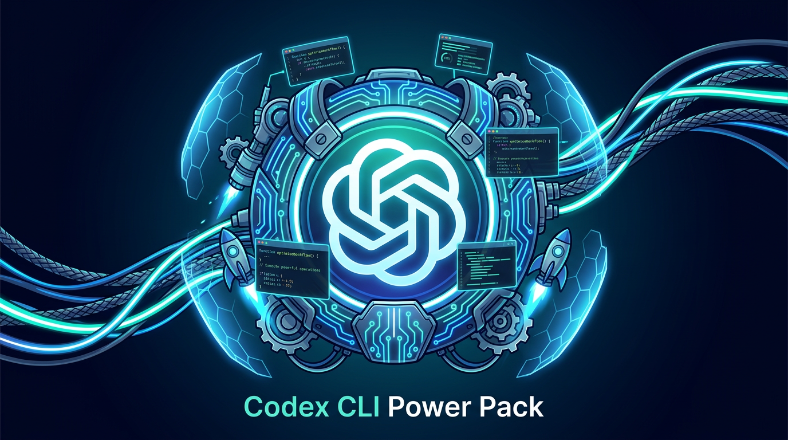

<div align="center">



# Codex CLI Power Pack

**실무에서 바로 쓸 수 있는 OpenAI Codex CLI 최적 에이전트 하네스**

`Skills` `AGENTS.md` `config.toml` 올인원

[](#changelog)
[](#스킬-목록)
[](LICENSE)
[](https://github.com/openai/codex)

</div>

---

## 왜 이게 필요한가?

Codex CLI는 강력하지만, **기본 상태에서는 50%만 활용**하고 있습니다.

| 문제 | 이 팩의 해결책 |
|------|---------------|
| 매번 같은 지시를 반복 | `AGENTS.md`로 글로벌 규칙 자동 적용 |
| 코드 리뷰/검증을 수동으로 | `$review` → `$verify` 스킬 체이닝 |
| 계획 없이 바로 코딩 | `$plan` → 구현 → `$verify` 워크플로우 |
| 이미지 생성 불가 | `$nano-banana` (Gemini NB2 통합) |
| Git 작업 분기 관리 번거로움 | `$worktree` (자동 커밋 기록 포함) |

## 설치

### 자동 설치 (권장)

```bash
curl -fsSL https://raw.githubusercontent.com/jh941213/my-codex-cli-asset/main/install.sh | bash
```

### 클론 후 설치

```bash
git clone https://github.com/jh941213/my-codex-cli-asset.git
cd my-codex-cli-asset
bash install.sh
```

### 수동 설치

```bash
mkdir -p ~/.codex
cp AGENTS.md ~/.codex/AGENTS.md
cp -r skills/* ~/.codex/skills/
cp config.toml ~/.codex/config.toml  # 선택
```

## 요구사항

- [OpenAI Codex CLI](https://github.com/openai/codex) (`npm i -g @openai/codex`)
- Node.js 22+
- Git

## 스킬 목록

### 워크플로우 스킬 (18개)

| 스킬 | 호출 | 용도 |
|------|------|------|
| plan | `$plan` | 복잡한 작업 전 계획 수립 |
| verify | `$verify` | 타입체크, 린트, 테스트, 빌드 검증 |
| review | `$review` | 코드 리뷰 |
| frontend | `$frontend` | 빅테크 스타일 UI 개발 |
| commit-push-pr | `$commit-push-pr` | 커밋 -> 푸시 -> PR |
| simplify | `$simplify` | 코드 단순화 |
| tdd | `$tdd` | 테스트 주도 개발 |
| build-fix | `$build-fix` | 빌드 에러 수정 |
| handoff | `$handoff` | HANDOFF.md 세션 인계 |
| techdebt | `$techdebt` | 기술 부채 정리 |
| spec | `$spec` | SPEC 기반 개발 인터뷰 |
| spec-verify | `$spec-verify` | 명세서 기반 검증 |
| e2e-verify | `$e2e-verify` | E2E 테스트 검증 |
| nano-banana | `$nano-banana` | Nano Banana 2 이미지 생성 |
| compact-guide | `$compact-guide` | 컨텍스트 관리 가이드 |
| worktree | `$worktree` | Git 워크트리 + 커밋 자동 기록 |
| prd | `$prd` | PRD(제품 요구사항 문서) 생성 |
| docs | `$docs` | 코드 변경사항 기반 자동 문서 생성 |

### 기술 스킬 (15개)

| 스킬 | 분야 |
|------|------|
| react-patterns | React 19 전체 패턴 |
| vercel-react-best-practices | React/Next.js 성능 최적화 |
| typescript-advanced-types | 고급 타입 시스템 |
| shadcn-ui | shadcn/ui 컴포넌트 |
| tailwind-design-system | Tailwind CSS 디자인 시스템 |
| ui-ux-pro-max | UI/UX 종합 가이드 |
| fastapi-templates | FastAPI 템플릿 |
| api-design-principles | REST/GraphQL API 설계 |
| async-python-patterns | Python 비동기 패턴 |
| python-testing-patterns | pytest 테스트 패턴 |
| e2e-agent-browser | 브라우저 E2E 테스트 |
| stitch-design-md | Stitch 디자인 시스템 |
| stitch-enhance-prompt | Stitch 프롬프트 최적화 |
| stitch-loop | Stitch 멀티페이지 생성 |
| stitch-react | Stitch React 변환 |

## 권장 워크플로우

**일반 개발**
```
$plan -> 구현 -> $review -> $verify -> $e2e-verify
```

**대규모 기능**
```
세션 1: $prd (기획) -> PRD.md 생성
세션 2: $spec (인터뷰) -> SPEC.md 생성
세션 3: SPEC.md 읽고 구현
세션 4: $spec-verify (검증)
```

**병렬 작업 (worktree)**
```
$worktree init -> $worktree create feature-auth -> 구현 -> $worktree cleanup
```

## 프로젝트 구조

```
my-codex-cli-asset/
├── AGENTS.md              # 글로벌 지시사항 (핵심 원칙 + 스킬 테이블)
├── config.toml            # Codex CLI 설정
├── install.sh             # 자동 설치 스크립트
├── assets/
│   └── hero.png           # README 배너 이미지
└── skills/                # 33개 스킬
    ├── plan/              ├── review/
    ├── verify/            ├── frontend/
    ├── commit-push-pr/    ├── simplify/
    ├── tdd/               ├── build-fix/
    ├── handoff/           ├── techdebt/
    ├── spec/              ├── spec-verify/
    ├── e2e-verify/        ├── nano-banana/
    ├── compact-guide/     ├── worktree/
    ├── prd/               ├── docs/
    ├── react-patterns/    ├── shadcn-ui/
    ├── typescript-advanced-types/
    ├── tailwind-design-system/
    ├── ui-ux-pro-max/     ├── fastapi-templates/
    ├── api-design-principles/
    ├── async-python-patterns/
    ├── python-testing-patterns/
    ├── vercel-react-best-practices/
    ├── e2e-agent-browser/
    ├── stitch-design-md/  ├── stitch-enhance-prompt/
    ├── stitch-loop/       └── stitch-react/
```

## Changelog

### v1.0.0 (2026-03-03)
- 33개 스킬 구성 (워크플로우 18 + 기술 15)
- `$worktree` — Git worktree 관리 + post-commit 자동 커밋 기록
- `$prd` — 인사이트 기반 PRD 생성 (리서치 + 5라운드 인터뷰)
- `$docs` — 코드 변경사항 기반 자동 문서 생성
- `$nano-banana` — Nano Banana 2 (`gemini-3.1-flash-image-preview`) 기반 이미지 생성
- AGENTS.md 글로벌 규칙 + 스킬 테이블
- 자동 설치 스크립트 (`install.sh`)

## 라이선스

MIT
